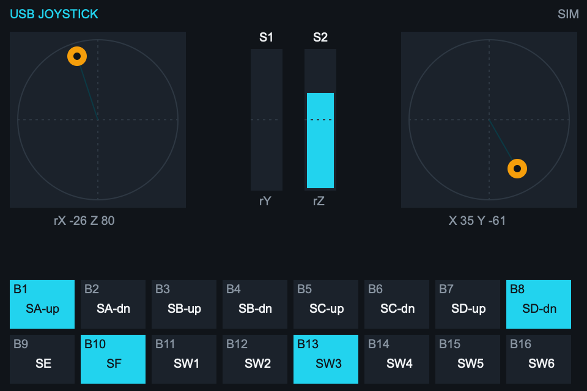

# QuadDash

*English | [Deutsch](README.de.md)*

An EdgeTX Lua widget for ELRS + Betaflight quads: a **preflight and debug dashboard** on your radio. It is not meant to be read during flight (your goggles are on then). It helps before takeoff and when troubleshooting: Is the link good? Is the battery full? Why won't it arm? How low did the voltage go?

Developed on a RadioMaster TX15 (EdgeTX 3.0, 480×320 color screen, ELRS 4.x). It should run on any EdgeTX radio with a color screen.

| Preflight | Link | Session |
|---|---|---|
|  |  |  |

*Screenshots come from the preview simulation (`tools/render.lua`). Fonts on the radio look slightly different.*

## What you need

- A radio with a **color screen** running **EdgeTX** (tested with 3.0). You can see your version under *SYS → Version*. Black-and-white radios are not supported.
- An **ExpressLRS** receiver on the quad with telemetry working (the default for ELRS).
- **Betaflight** on the flight controller. Betaflight sends battery voltage, current, flight mode and attitude over the ELRS link automatically, no extra setup needed. Current and mAh only show up if your FC or ESC has a current sensor.
- **Arm switch on channel 5** (AUX1). This is the ELRS standard, so if you followed a normal ELRS setup, you already have it.

## Installation

1. **Download** this repository: click the green **Code** button at the top of this page, then **Download ZIP**, and unzip it.
2. **Connect the radio** to your computer with a USB cable. When the radio asks, choose **USB Storage (SD)**. The SD card appears as a drive on your computer.
3. **Copy the widget:** copy the folder `WIDGETS/QuadDash` from the ZIP into the `WIDGETS` folder on the SD card. Afterwards this file must exist: `/WIDGETS/QuadDash/main.lua`. Eject the drive and unplug the cable.
4. **Discover telemetry sensors:** power up the quad (with a battery, so the link is up), then on the radio go to *MDL → Telemetry → Discover new sensors*. Wait until sensors like `RxBt`, `RQly` and `1RSS` appear, then stop discovery. This is needed once per model.
5. **Add the widget to a screen:** open the screen setup for your model (*Screens* / *User interface* in the model or quick menu, depending on your EdgeTX version), add a new screen, choose the **full-screen layout with one zone**, tap the zone and select **QuadDash**. Turning off the top bar and sliders in the layout settings gives the widget more room.
6. Back on the main view, swipe or page to the new screen. Done.

If the zone is too small (under 300×170 pixels), the widget only shows a compact status line with cell voltage and LQ.

## Pages

The **header** on every page shows the arm status (DISARMED / ARMED / ARM BLOCKED / FAILSAFE / NO LINK / WAITING FOR QUAD), the Betaflight flight mode, the page title, cell count, flight time and the **radio battery** (icon + voltage). The radio battery gauge uses the battery range from your radio settings and turns red at the warning threshold.

1. **Preflight:** round gauges for voltage per cell, link quality (LQ) and current. Bars for RSSI and battery %. A traffic-light checklist: link good, battery full, arm switch off, arming allowed (no Betaflight arming error)
2. **Link:** uplink/downlink LQ, RSSI of both receiver antennas (the active one is highlighted), SNR, TX power and RF mode. A graph of the last 60 seconds, link losses shown in red
3. **Session:** flight time (counts only while armed), cell voltage at start and minimum, mAh used, maximum current, minimum LQ/RSSI, number of link losses and the longest outage. An artificial horizon to check that the flight controller orientation is set up correctly

When telemetry is lost, a banner shows the last known values:


## Using the widget

**Full screen:** an EdgeTX widget only receives buttons and touch input in full-screen mode. Select the widget (tap it or long-press) and choose *Full screen*. Long-press RTN/EXIT to leave full screen.

- Change page: swipe, scroll wheel, PAGE key, or tap the header
- Reset statistics: long-press ENTER, or the *Reset* button on page 3

In the normal (non-full-screen) view, the option `Page` decides which page is shown.

Statistics also reset automatically when you plug in a new battery (see *How it works* below), so normally you never need to reset by hand.

## Options

Open them via the widget settings (select the widget, then *Widget settings*).

| Option | Default | Meaning |
|---|---|---|
| `Page` | 1 | Page shown in the normal view (1–3) |
| `Cells` | 0 | Cell count, 0 = detect automatically (`ceil(V / 4.35)`) |
| `LowCell` | 350 | Warning threshold in 1/100 V per cell (350 = 3.50 V) |
| `CritCell` | 330 | Critical threshold in 1/100 V per cell (330 = 3.30 V) |
| `Voice` | on | Spoken warning when the cell voltage is low |
| `MuteSw` | – | Switch that mutes the warnings, e.g. a button (see below) |
| `Language` | English | Language of the widget (English or Deutsch) |

The `Language` option only changes the text on screen. Spoken warnings use the voice pack installed on your radio.

Automatic cell detection works for LiPo and LiHV packs from full down to storage voltage. A nearly empty pack (below about 3.3 V per cell) may be detected with one cell too few. If you often plug in empty packs, set `Cells` to your fixed cell count.

## Muting the warnings

With the option `MuteSw`, any switch can mute the voice warnings, for example while you tune the quad in Betaflight on the bench.

- While muted, a red **MUTED** appears on the right side of the header.
- **Muting never applies in flight:** once you arm, warnings are active again and the header shows an orange **ACTIVE**.
- If the flight controller is only powered over USB (under 2 V, only while disarmed), the widget recognizes "no battery", shows **USB** and does not warn anyway.

On the TX15, one of the six buttons with RGB LEDs works well for this:
1. *MDL → Setup → Customizable Switches*, select SW6.
2. Type **2POS** (latching), start state **Off**, so the radio is never muted after power-on.
3. Color **On = red**, Off = dark.
4. In the QuadDash options, set `MuteSw` = SW6.

## Troubleshooting

- **Values show `--`:** the sensor is missing. Run *Discover new sensors* again with the quad powered (installation step 4). Current and mAh stay empty without a current sensor on the quad.
- **Header says WAITING FOR QUAD:** the radio has no link to the receiver yet. Check that the quad is powered and bound.
- **Wrong cell count:** set the option `Cells` to your pack's cell count.
- **ARM BLOCKED:** Betaflight refuses to arm. Connect the quad to the Betaflight Configurator to see the reason (for example throttle not low, quad not level, or USB connected).
- **Arm status looks wrong:** the widget expects the arm switch on channel 5 (AUX1).
- **Widget does not appear in the list:** check the path on the SD card, it must be exactly `/WIDGETS/QuadDash/main.lua`.

## How it works

- **Sensors:** ELRS link sensors (`1RSS`, `2RSS`, `RQly`, `RSNR`, `ANT`, `RFMD`, `TPWR`, `TRSS`, `TQly`, `TSNR`) and Betaflight telemetry (`RxBt`, `Curr`, `Capa`, `Bat%`, `FM`, `Ptch`, `Roll`, `Yaw`). Missing sensors are shown as `--`.
- **Arm status:** CH5 (ELRS arm channel) is on **and** the Betaflight flight mode does not end with `*` (disarmed) and does not contain `!ERR` (arming blocked).
- **Link status:** via `getRSSI() > 0`.
- **New session** (automatic reset): when the cell count changes, when you have not flown yet, or with a full battery (≥ 4.0 V/cell and more than 0.4 V above the previous minimum). After a crash the voltage recovers without load; the data is kept in that case.
- **Voice warning:** "Battery low" + value when the cell voltage stays below the threshold for 3 s. Repeats every 30 s, every 10 s when critical. EdgeTX itself handles link warnings.

## Development

The tools need a local Lua (`brew install lua`) and run from the repo root:

```sh
lua tools/sim.lua      # scenarios against a mocked EdgeTX API
lua tools/render.lua   # SVG preview of all pages into preview/
```

`sim.lua` removes the string metatable because EdgeTX has no string methods. `s:find()` fails there with *attempt to index a string value*, so the widget always uses `string.find(s, …)`.

## Bonus: JoyView (USB joystick view)

A second widget in `WIDGETS/JoyView/` for a model you use as a **USB joystick for simulators and games**. It shows what the game sees: both sticks (mode 2), the axes CH5–8 as sliders and the buttons CH9–32 as a grid labelled with their **joystick button number** (B1, B2, …). That makes binding functions in a game easy. Pressed buttons light up.



- Expects the USB joystick in **Classic** mode (*MDL → USB Joystick*): CH1–8 are axes, CH9–32 are buttons, and a button counts as pressed while its channel is above 0.
- Labels come from the **mixer names**, so the widget adapts to your own mapping.
- Example mapping: S1/S2 on CH5/CH6, each 3-position switch as two buttons (up/down, one `MAX` mix with the switch position as condition), SE, SF and SW1–SW6 as single buttons. Set SW1–SW6 to *Toggle* (momentary) in that model, because games expect key presses rather than keys that stay down.
- No options; add it to a full-screen layout.

## Planned

- GPS page (satellites, distance/direction to home, maximum values, last known position after link loss)
- GPS fix in the preflight checklist
- Write the last position to the SD card on link loss

## License

[MIT](LICENSE)
