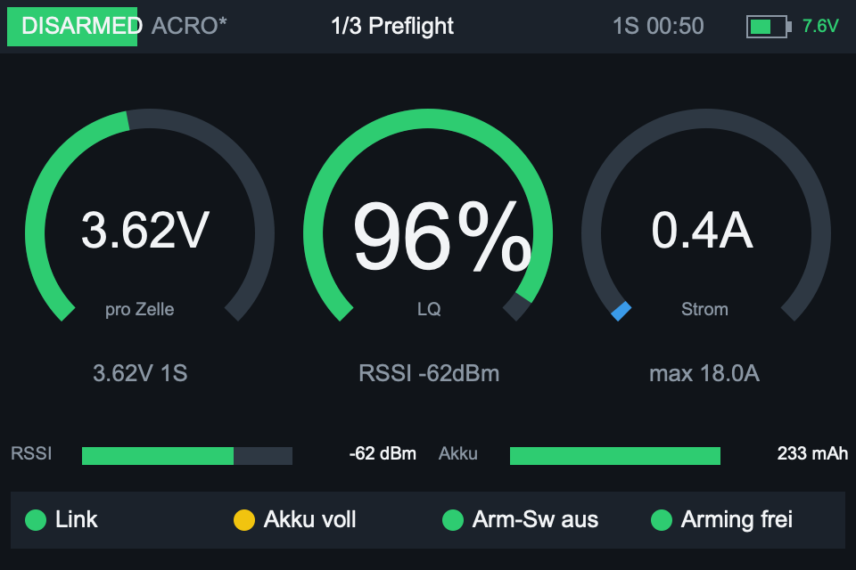
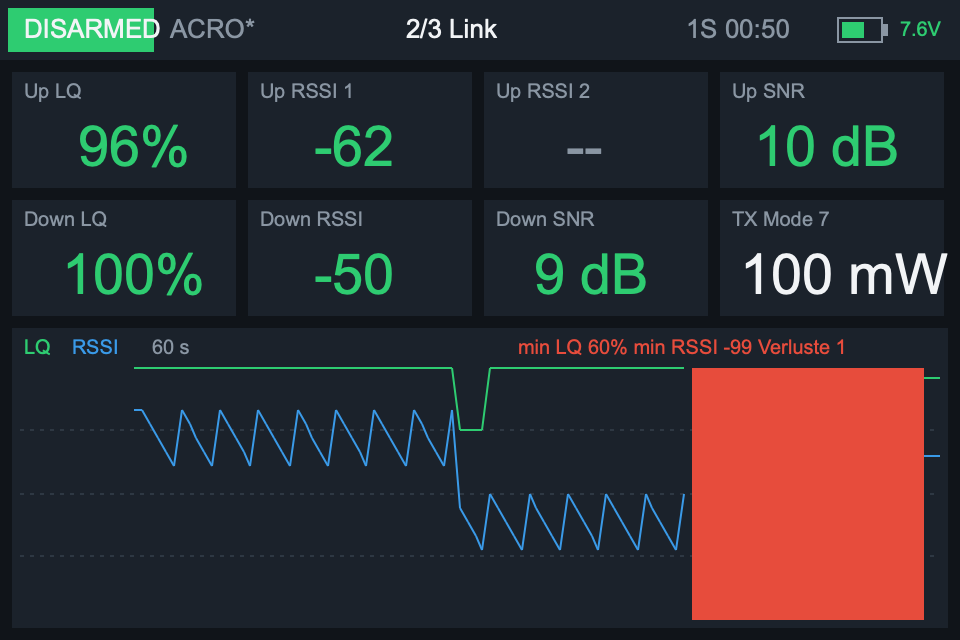
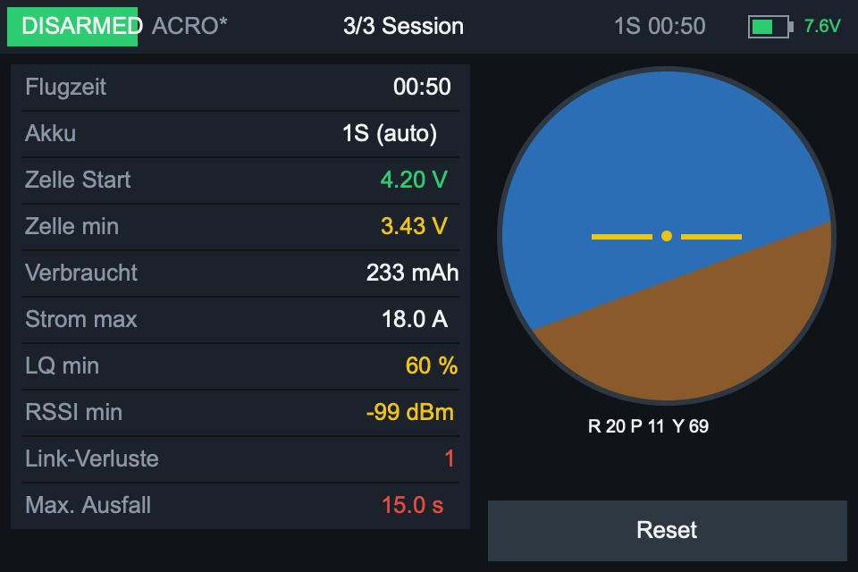
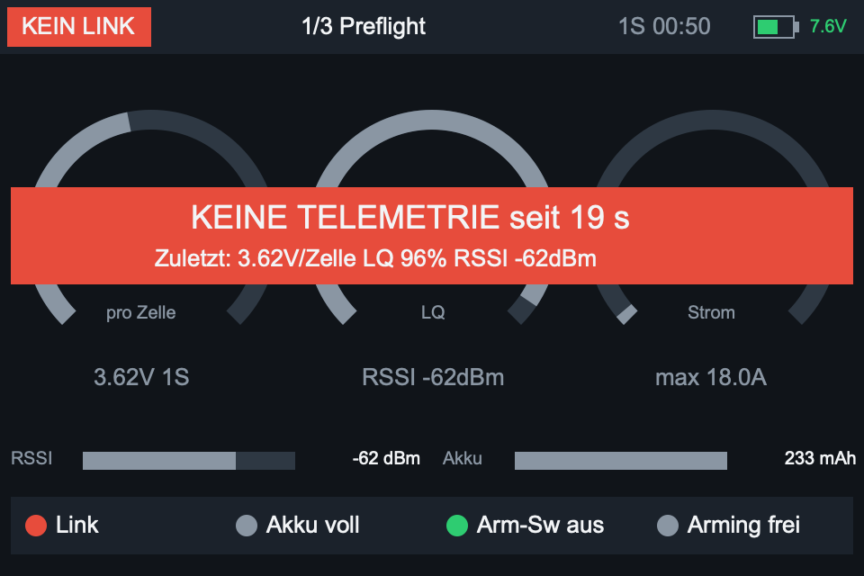

# QuadDash

EdgeTX-Lua-Widget für ELRS- und Betaflight-Quads: ein **Preflight- und Debug-Dashboard** für den Sender. Es soll nicht während des Flugs abgelesen werden (dann ist die Brille auf), sondern vor dem Start und bei der Fehlersuche helfen.

Entwickelt für die RadioMaster TX15 (EdgeTX 3.0, 480×320 Farbdisplay, ELRS 4.x). Es sollte auf jedem EdgeTX-Farbdisplay laufen.

| Preflight | Link | Session |
|---|---|---|
|  |  |  |

*Die Bilder stammen aus der Vorschau-Simulation (`tools/render.lua`). Die Schriften auf dem Sender sehen etwas anders aus.*

## Seiten

Die **Kopfzeile** auf allen Seiten zeigt den Arm-Status (DISARMED/ARMED/ARM GESPERRT/FAILSAFE/KEIN LINK), den Betaflight-Flugmodus, den Seitentitel, Zellenzahl und Flugzeit sowie den **Akku des Senders** (Symbol + Spannung). Die Prozentanzeige richtet sich nach den Akku-Schwellen in den Radio-Einstellungen (Min/Max/Warnung), rot ab der Warnschwelle.

1. **Preflight**: Rundinstrumente für Spannung pro Zelle, LQ und Strom. Balken für RSSI und Akku-%. Ampel-Checkliste: Link, Akku voll, Arm-Schalter aus, Arming frei (Betaflight `!ERR`)
2. **Link**: Uplink/Downlink LQ, RSSI beider Antennen (die aktive ist markiert), SNR, TX Power, RF-Mode. Verlaufsgraph der letzten 60 s, Link-Verluste in Rot
3. **Session**: Flugzeit (zählt nur armed), Zellenspannung Start/Minimum, verbrauchte mAh, maximaler Strom, minimale LQ/RSSI, Link-Verluste und längster Ausfall. Künstlicher Horizont zum Prüfen der FC-Ausrichtung

Bei Telemetrie-Verlust erscheint ein Banner mit den letzten bekannten Werten:



## Installation

1. `WIDGETS/QuadDash/` auf die SD-Karte des Senders nach `/WIDGETS/` kopieren. Den Sender dazu per USB verbinden und „USB Storage“ wählen.
2. Im Modell einen Bildschirm mit Vollbild-Layout (1 Zone) anlegen und das Widget **QuadDash** auswählen.
3. Die Telemetrie-Sensoren müssen erkannt sein (*MDL → Telemetry → Discover new sensors*).

## Optionen

| Option | Standard | Bedeutung |
|---|---|---|
| `Page` | 1 | Seite in der normalen Ansicht (1–3) |
| `Cells` | 0 | Zellenzahl, 0 = automatisch (`ceil(V / 4,35)`) |
| `LowCell` | 350 | Warnschwelle in 1/100 V pro Zelle |
| `CritCell` | 330 | kritische Schwelle in 1/100 V pro Zelle |
| `Voice` | an | Sprachwarnung bei niedriger Zellenspannung |

## Bedienung (Vollbild)

- Seite wechseln: wischen, Drehrad, PAGE-Taste oder Kopfzeile antippen
- Statistik zurücksetzen: ENTER lang oder „Reset“ auf Seite 3

Tasten- und Touch-Events bekommt ein EdgeTX-Widget nur im Vollbild. In der normalen Ansicht legt deshalb die Option `Page` die Seite fest.

## Voraussetzungen und Logik

- **Sensoren:** ELRS-Link-Sensoren (`1RSS`, `2RSS`, `RQly`, `RSNR`, `ANT`, `RFMD`, `TPWR`, `TRSS`, `TQly`, `TSNR`) und Betaflight-Telemetrie (`RxBt`, `Curr`, `Capa`, `Bat%`, `FM`, `Ptch`, `Roll`, `Yaw`). Fehlende Sensoren zeigt das Widget als `--` an.
- **Arm-Status:** CH5 (ELRS-Arm-Kanal) ist an **und** der Betaflight-Flugmodus endet nicht auf `*` (disarmed) und enthält kein `!ERR` (Arming gesperrt).
- **Link-Status:** über `getRSSI() > 0`.
- **Neue Session** (automatischer Reset): bei anderer Zellenzahl, wenn noch nicht geflogen wurde, oder bei vollem Akku (≥ 4,0 V/Zelle und mehr als 0,4 V über dem bisherigen Minimum). Nach einem Crash erholt sich die Spannung ohne Last, dabei bleiben die Daten erhalten.
- **Sprachwarnung:** „Battery low“ + Wert, wenn die Zellenspannung 3 s unter der Schwelle bleibt. Wiederholung alle 30 s, kritisch alle 10 s. Link-Warnungen übernimmt EdgeTX selbst.

## Entwicklung

Die Tools brauchen ein lokales Lua (`brew install lua`) und laufen aus dem Repo-Root:

```sh
lua tools/sim.lua      # Szenarien gegen eine nachgebaute EdgeTX-API
lua tools/render.lua   # SVG-Vorschau aller Seiten nach preview/
```

`sim.lua` entfernt die String-Metatable, weil EdgeTX keine String-Methoden kennt. `s:find()` führt dort zu *attempt to index a string value*, deshalb verwendet das Widget immer `string.find(s, …)`.

## Geplant

- GPS-Seite (Satelliten, Entfernung/Richtung zum Home-Punkt, Maximalwerte, letzte bekannte Position nach Link-Verlust)
- GPS-Fix in der Preflight-Checkliste
- Letzte Position bei Link-Verlust auf die SD-Karte schreiben
